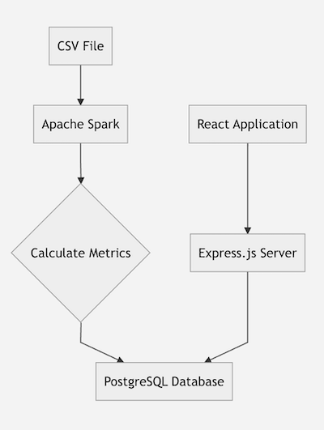
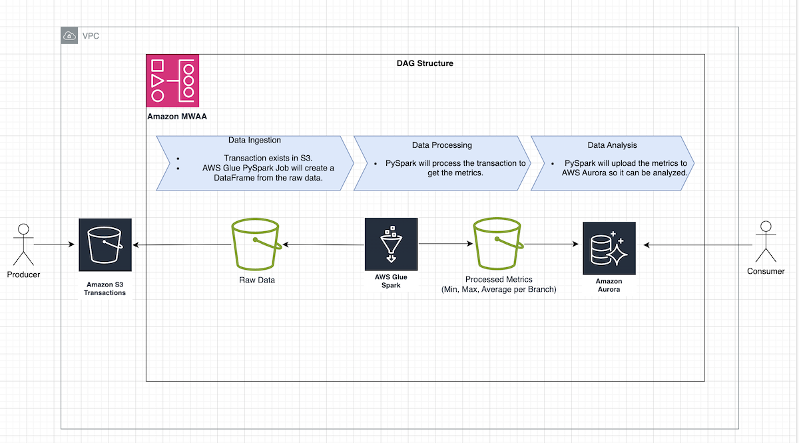
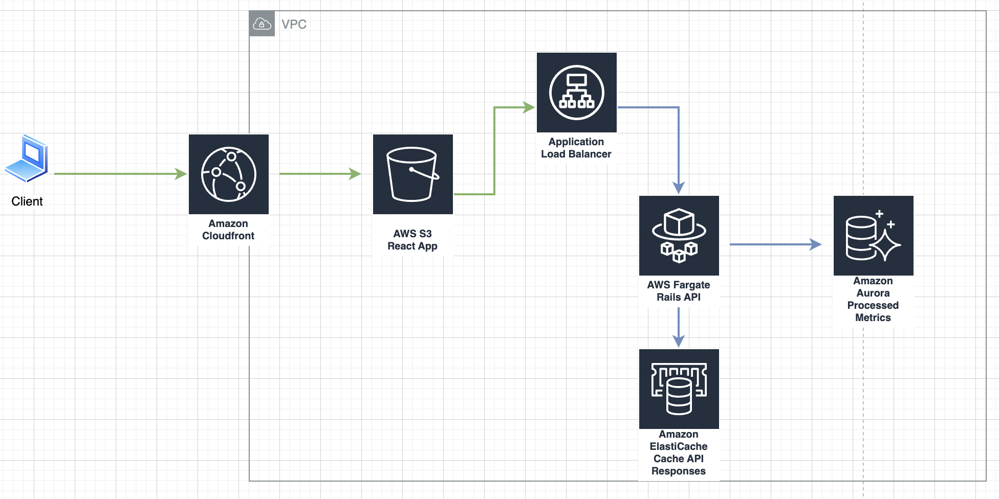

# Financial Transactions Processor

## Exercise

Design & implement a system that can

1.  Load a data file containing at least 100M financial transactions (a timestamp, a branch code, and amount).
2.  Report the minimum, maximum, and average dollar amounts per bank branch.

## Solution

 1. Batch Processing - Local Setup, Demo and Enterprise discussion.

# Batch Processing
## Assumptions
This solution assumes a Producer uploads a CSV file containing at least 100M financial transactions to an object store or filesystem.

## Goals

 - Automatically process CSV files using a scalable, performant and cost effective ETL.
 - Display the report using a scalable and cost effective UI.

## Local Setup and Demo

### Overview
The goal of the local setup is to provide a free, proof of concept app capable of processing CSV files with at least 100M transactions and report on the processed metrics. To accomplish this, Apache Spark is used. There is a PySpark ETL Job `spark_processor.py`. It extracts the data from the CSV, transforms the data to get valuable metrics and then loads the data into a postgres db for further analysis.
The local setup also includes a small Express.js backend and React frontend to display the processed metrics.

  
### Tech Decisions

- **Apache Spark**
  - **Purpose**: Used for big data processing. Optimized to handle batch data processing and widely used for ETL processes.
  - **Alternatives**:
    - **Flink**: Similar to Spark but optimized for real-time data processing.

- **PostgreSQL**
  - **Purpose**: Open-source relational database with a proven architecture.
  - **Alternatives**:
    - **MySQL**: Optimized for efficiency, often favored for web apps but less geared towards data analysis.

- **ExpressJS**
  - **Purpose**:  Web app framework that is quick to set up and prototype with.
  - **Alternatives**:
    - **Rails**: Feature-rich web app framework.

- **React**
  - **Purpose**: JavaScript library for building reactive user interfaces.
  - **Alternatives**:
    - **Vue.js**: Another reactive framework, not chosen primarily due to familiarity and experience with React.

## Enterprise Setup

### Overview
The goal of the enterprise setup is to provide a scalable and cost effective system by using managed and serverless AWS services wherever possible. To accomplish this, multiple AWS services are used.
AWS MWAA is used to orchestrate an ETL process. The ETL process is executed by AWS Glue, which will leverage Apache Spark to perform the ETL similar to the local setup. It will read a CSV from S3, calculate metrics, and upload them to an AWS Aurora db.
The UI app layer will use AWS CloudFront to serve a compiled React app in S3. The React app will communicate with a Rails API, which runs in AWS Fargate behind an AWS ALB and retrieves processed metrics from the same Aurora db.

### AWS MWAA DAG Workflow

### Application Layer

### Tech Decisions

#### Data Process Layer
- **AWS MWAA** (AWS Managed Workflows for Apache Airflow)
  - **Purpose**: Managed DAG solution. Automates the orchestration of data workflows and seamlessly integrates with other AWS services.
  - **Alternatives**:
    - **Apache Airflow on EC2**: Manually managing Airflow on EC2 instances provides more control but requires significant setup and maintenance.

- **AWS S3 - Single CSV**
  - **Purpose**: Scalable, durable object store. Seamlessly integrates with other AWS services. Glue can easily process a single CSV.
  - **Alternatives**: Partitioned transaction data in S3. The exercise implied a single file, however Glue could handle multiple sources as well. A Glue Crawler would be needed to create the Glue Data Catalog.

- **AWS Glue**
  - **Purpose**: Serverless, scalable, and managed ETL service that integrates well with other AWS services. Can leverage Spark.
  - **Alternatives**:
    - **AWS EMR**: Offers more flexibility and control compared to Glue, but requires more management.

- **AWS Aurora**
  - **Purpose**: Relational database solution. Managed service and integrates well with other AWS services.
  - **Alternatives**:
    -  **DynamoDB**: NoSQL database solutions. A relational database is preferred for its efficiency in handling complex queries and aggregations on structured data.

#### Application Layer
- **AWS CloudFront**
  - **Purpose**: CDN
  - **Alternatives**:
    - **Cloudflare**: CloudFront was chosen over Cloudflare for its seamlessly integration with other AWS services.

- **AWS S3 to Serve React App**
  - **Purpose**: Amazon S3 hosts the compiled React application, providing a highly available and scalable solution for serving CSR apps.
  - **Alternatives**:
    - **Fargate running Nginx**: Serve the Frontend app via web servers. Better suited for SSR apps.

- **AWS ALB (Application Load Balancer)**
  - **Purpose**: ALB
  - **Alternatives**:
    - **Nginx**: Can be used as a load balancer with more manual setup and management.

- **Rails Application running on Fargate**
  - **Purpose**: AWS Fargate abstracts the server management and scaling. GraphQL over REST (or both) should be considered based on consumer use cases.
  - **Alternatives**:
    - **EKS**: Offers more control over container orchestration, more complex to setup and configure.

- **ElastiCache for the Rails App Caching**
  - **Purpose**: Amazon ElastiCache is used to enhance the performance of the Rails application by caching frequently accessed data.
  - **Alternatives**:
    - **Redis on EC2**: Self-managed Redis provides more configuration options and control.

## Estimated Cost
  - Data Process Layer (100M transactions processed per day): ~$550/month
  - Application Layer: ~$350/month

## Further Considerations
  
  - **Security**: Standard security patterns should be followed. Least privileged and separation of access. IAM roles and policies should be used to control interactions and resources. A comprehensive threat model doc should be created and reviewed with a security expert.
  - **Database**: Read replicas and indexes should be added based on consumer use cases. Currency amounts should be stored as two integers rather than a single float to avoid precision errors.

